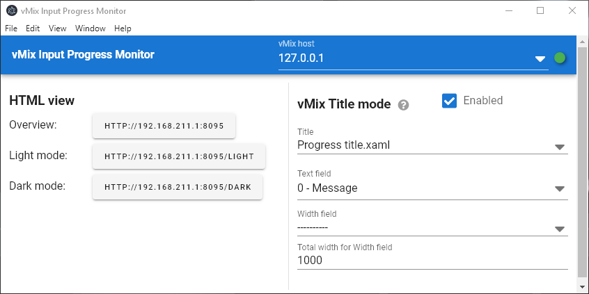
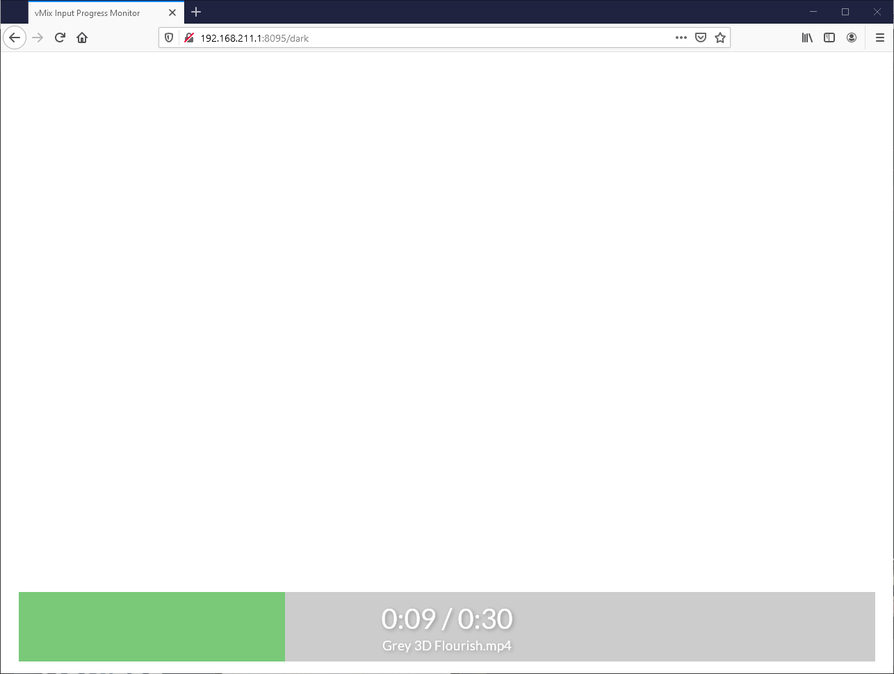

# vinproma

[]()


**v**Mix **In**put **Pro**gress **M**onitor **A**pp (shortened: *vinproma*) built with [ElectronJS](https://electronjs.org). ElectronJS is a cross-platform framework allowing the app to be built for each Windows, Mac or Linux. 

The app allows simple monitoring of realtime progress of the current playing video or audio track. The input in preview can also be to monitored in the HTML view.

You are free to clone the repository to develop your own app based in this code.

## App overview


## HTML view


## Downloads

See the [Releases](../../releases) tab for a direct download of the app for Mac and Windows.

## Feature summary
 - Read progress of current input in program
 - HTML view: View progress as a HTML page - Light or dark mode
 - vMix title mode: Send progress to a vMix title input of your choice

## Project architecture
The project consists of several components. The app is built with Electron, meaning that the app can be compiled for Windows, Mac or Linux.

The Electron frontend (also called "Renderer") serves the purpose of fetching info from a vMix instance, and letting the user see the state of the vMix instance connection and other settings. 

A web server lives on the backend side of the Electron app, serving requests from the users on port 8095. The web server includes a web socket server, serving flowing real time TCP/IP data to the connected clients/browsers.

The web server communicates with the Electron frontend app, where practically realtime data from the vMix instances is passed as following:

Electron renderer -> (via IPC) -> Electron backend -> Web server -> (via Web Socket) -> Web clients

## Known issues
When running in development mode you can experience loss of connection to the vMix instance after some minutes.

## Roadmap

 - [ ] Add XAML template


## Project setup
### Install dependencies (based on package.json)
```
yarn
```

### Compiles and hot-reloads for development
```
yarn electron:serve
```

### Compiles and minifies for production
```
yarn electron:build
```

### Lints and fixes files
```
yarn lint
```

### Web frontend assets
Note that in **src/web-frontend** there is also source code for the compiled assets for the web frontend.
You should also install the dependencies for this by running
```
cd src/web-frontend
yarn
```

Compiles and hot-reloads for development
```
yarn watch
```

There is also a alias for this in the main package.json:
```
yarn web-assets-watch
```
And also before building the Electron app, a command to build web frontend assets for production can be run:
```
yarn web-assets-prod
```

### Customize configuration
See [Configuration Reference](https://cli.vuejs.org/config/).
